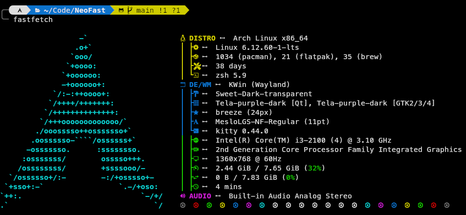

# 🚀 Awesome Fastfetch Setup

<div align="center">

[](https://github.com/fastfetch-cli/fastfetch)
[](https://fastfetch-cli.github.io/)
[](LICENSE)

*A modular, lightweight configuration manager for FastFetch that brings style to your terminal*



</div>

---

## ✨ Features

* **Three Curated Presets**: Choose between Compact, Minimal, or Full information displays.
* **Smart Backups**: Automatically backups your existing `config.jsonc` before making changes.
* **Shell Integration**: One-click setup to run FastFetch whenever you open your terminal.
* **Non-Interactive Mode**: Perfect for automated "dotfile" installation scripts.
* **Safety First**: Built with error handling (`set -euo pipefail`) to prevent system misconfiguration.

---

## 🚀 Quick Start

### 1. Prerequisites

Ensure you have **FastFetch** installed. Because Fastfetch is updated frequently, it is highly recommended to follow: https://github.com/fastfetch-cli/fastfetch to get the latest version for your specific OS.

**Quick Commands for common distros:**

* **Arch Linux**: `sudo pacman -S fastfetch`
* **Fedora**: `sudo dnf install fastfetch`
* **Ubuntu/Mint/Debian**:`sudo apt update && sudo apt install fastfetch`
* **openSUSE**: `zypper install fastfetch`
* **Homebrew**: `brew install fastfetch`

### 2. Usage

Clone the repository or download the script, 
```bash
git clone https://github.com/sakibreza229/awesome-fastfetch.git
cd awesome-fastfetch
```

Then grant execution permissions:

```bash
chmod +x ./awesome-fastfetch.sh
```

Run the script and follow the interactive prompts:

```bash
./awesome-fastfetch.sh
```

### 3. Command Line Options

For automation or power users, you can bypass the menus using flags:

| Flag | Description |
| --- | --- |
| `-c, --config [type]` | Specify preset: `compact`, `minimal`, or `full` |
| `-n, --non-interactive` | Run without prompts (uses defaults) |
| `--skip-shell` | Apply the config but do not modify your `.bashrc/.zshrc` |
| `-h, --help` | Show help menu |

**Example (One-liner):**

```bash
./setup.sh --config minimal --non-interactive --skip-shell
```

---

## 🛠️ Customization

After running the script, your active configuration is located at:
`~/.config/fastfetch/config.jsonc`

You can edit this file to change the ASCII logo, colors, or displayed modules.

---

## ⚠️ Important Note

This script **does not** install the FastFetch binary. It is a configuration manager designed to help you style and manage your settings easily.

---
